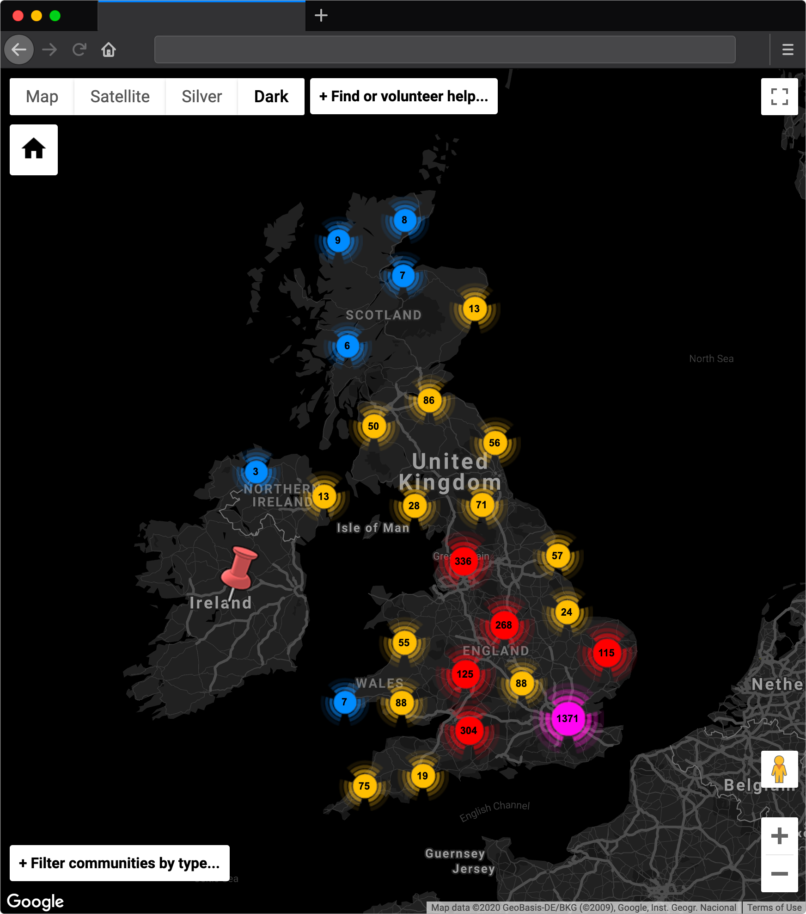

# Support community map

This is the source code for the [COVID-19 local support community map](https://www.policerewired.org/home/covid-19/communities), developed by volunteers from [Police Rewired](https://policerewired.org) and other communities operating through the [London College of Political Technologists](https://nwspk.com).

* To find a local support group: [View the map page](https://www.policerewired.org/home/covid-19/communities)
* To join the wider crowdsourced community, see: [The Coronavirus Tech Handbook](https://coronavirustechhandbook.com)

## Developers

To modify this site:

* First, fork it on GitHub.
* Make modifications.
* Once ready, commit and push to GitHub.
* Submit a pull request with your commit.

### Libraries

The map uses the Google Maps javascript API, with data sourced from [this crowdsourced sheet](https://docs.google.com/spreadsheets/d/117ukLjXiz8EfMjP-q9Aiu5XepQ39XK1W4DTMsE87llw/edit?usp=sharing) of communities.

jQuery is used to facilitate a quick and dirty call to retrieve the sheet's data in CSV format. The jQuery-csv plugin is then used to construct objects from the CSV data, which are then plotted to the map as markers.

* [jQuery](https://jquery.com/)
* [jQuery-csv](https://github.com/typeiii/jquery-csv)
* [Google Maps javascript API](https://developers.google.com/maps/documentation/javascript/tutorial)
